# AnimeGamePatch

For who have Android 8 or crash issue can try use this Patch.<br />
This Patch using [apk-mitm](https://github.com/shroudedcode/apk-mitm)<br />
<br />Feel free dm me on [Telegram](https://t.me/ElashXander) If you want need help how to use this or have issue install
- [x] No Root
- [x] Root
- [ ] Install Mitmproxy with pipx
- [ ] Manual Install 
- [x] Autoscript

#### This just for install mitmproxy
Maybe for now just for install mitmproxy and change a server as you want<br />
This good for beginner/who don't know about Termux

#### Download File
Download Termux from [F-Droid](https://f-droid.org/repo/com.termux_118.apk) [Recommend]

Download Anime Game Patch 2.8 from [Release](https://github.com/ElaXan/AnimeGamePatch/releases/tag/2.8)\
[OR YOU CAN DOWNLOAD FROM SCRIPT]

### FOR ROOT USERS
If you have no internet after run mitmproxy with script\
Just enter this command and paste to termux
```bash
su -c settings put global http_proxy :0
```

# No Termux
No Termux or mitmproxy go to [YuukiProxy](https://github.com/ElaXan/YuukiProxy)

# Termux
#### Information
This need proxy settings on your phone. ~~No need install cert on your phone but follow the script said until it success.~~ If you don't know about this go to [Proxy Settings](https://github.com/ElaXan/AnimeGamePatch#proxy-settings).

#### Termux Command
<details markdown='1'><summary>How to</summary>

1. Enter command :\
`termux-setup-storage`
* Just allow it like this picture :
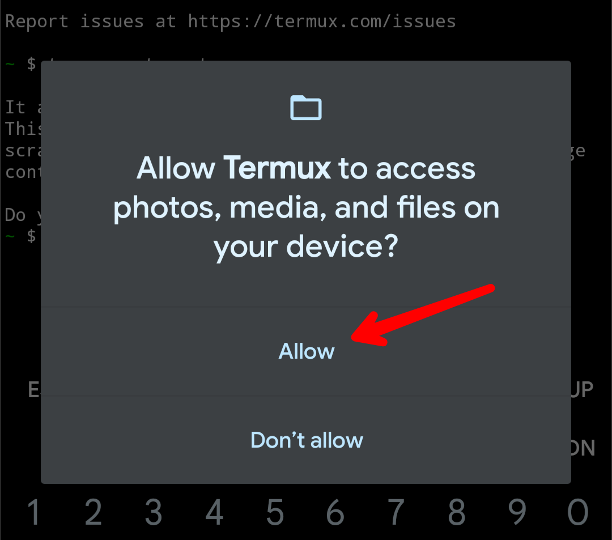

2. Enter command : <br />

`termux-change-repo`\
~ Press on [OK] or Enter on your keyboard <br />
~ Select "Mirrors by A1batross" then Press [OK] <br />
* Do same like this Picture :
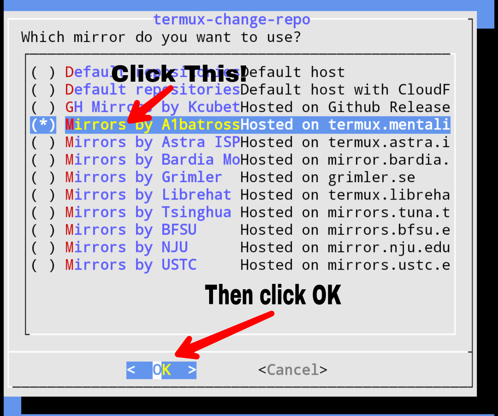

3. Enter command : <br />

```bash
pkg update && curl -Ls https://raw.githubusercontent.com/ElaXan/AnimeGamePatch/main/install.sh | bash
```
<br />
4. Enter command : <br />

```zex```
<br />~ If ask "motd (Y/I/N/O/D/Z) [default=N] ?" <br />
press Enter on your Keyboard <br />
<br />5. Follow what script said
<br />6. DONE✓

</details>

# Shortcut Commands
Commands for ```zex```
#### zex 1
install program and mitmproxy
#### zex 2
Change server or domain
#### zex 3
Run mitmproxy

# Proxy Settings
#### Mobile data
<details markdown='1'><summary>How to</summary>

go to settings and use search function, and search word `Access point Name` and click on **+**. Then enter Proxy and Port as like this picture :


</details>


#### WiFi
<details markdown='1'><summary>How to</summary>
For WiFi just follow this picture : <br />

**Step 1**\
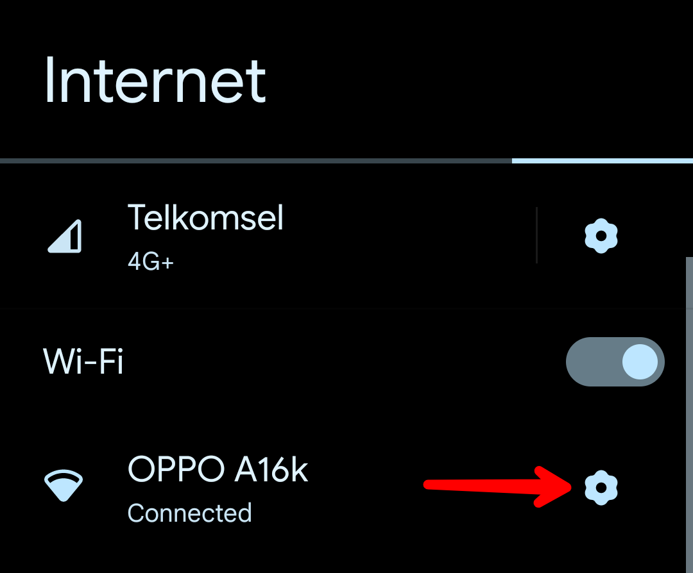\
**Step 2**\
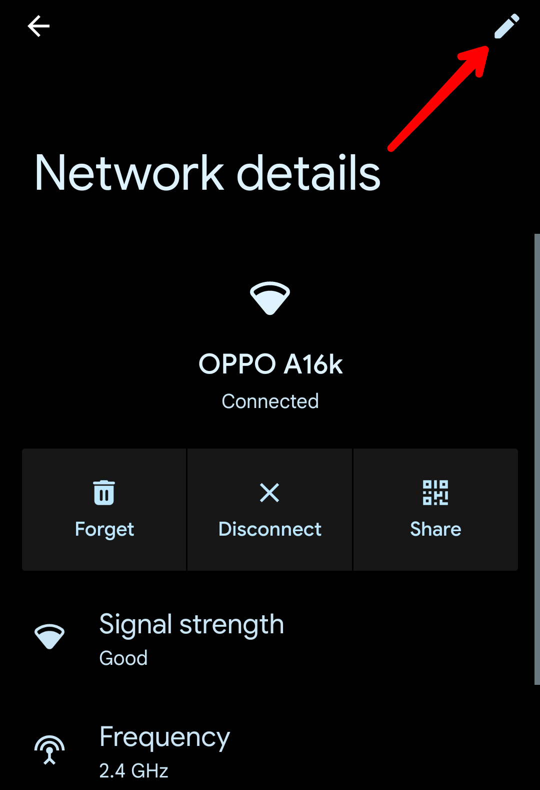\
**Step 3**\
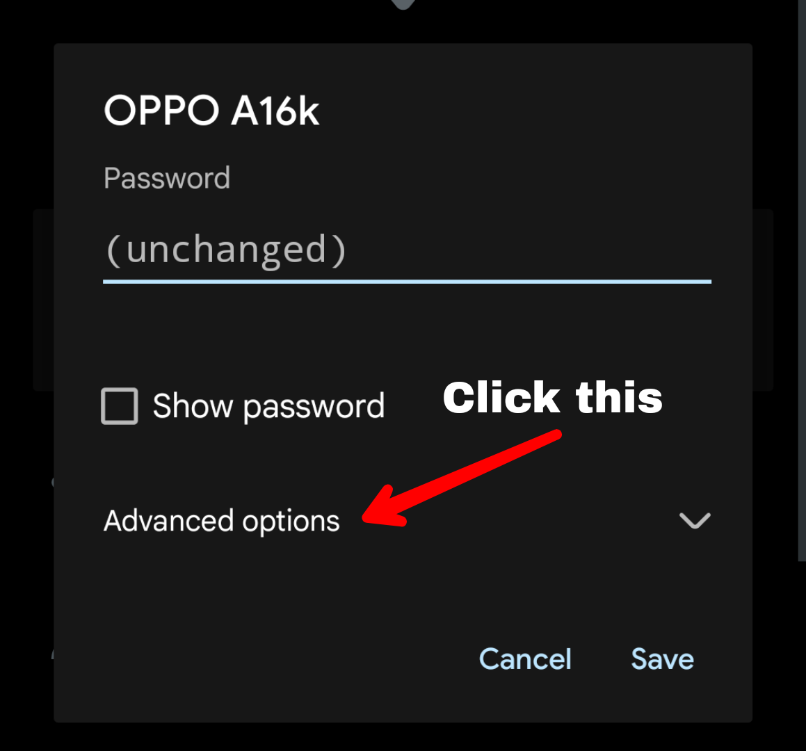\
**Step 4**\
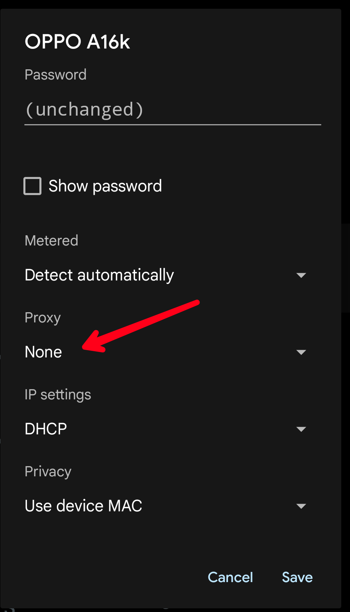\
**Step 5**\
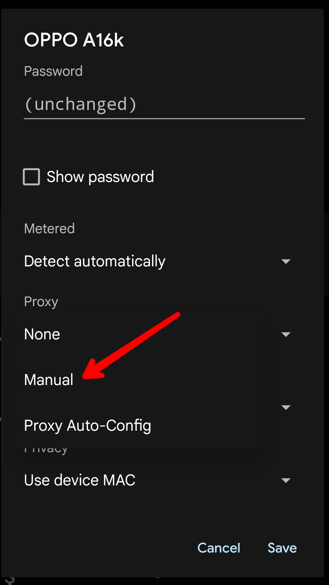\
**Step 6**\
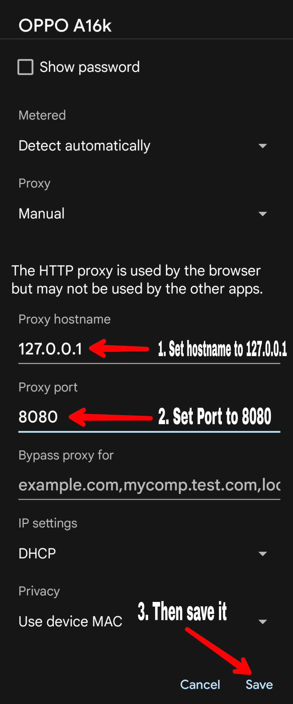

</details>

# Install certificate on your phone
#### Download certificate
Go to [mitm.it](http://mitm.it) but settings proxy on your phone, see [here](https://github.com/ElaXan/AnimeGamePatch#proxy-settings) for how to do that
And run `mitmdump --ssl-insecure` on Termux then open [mitm.it](http://mitm.it)

#### Install Certificate 
<details markdown='1'><summary>How to</summary>
First open settings and search "CA Certificate" then follow this picture step by step<br />
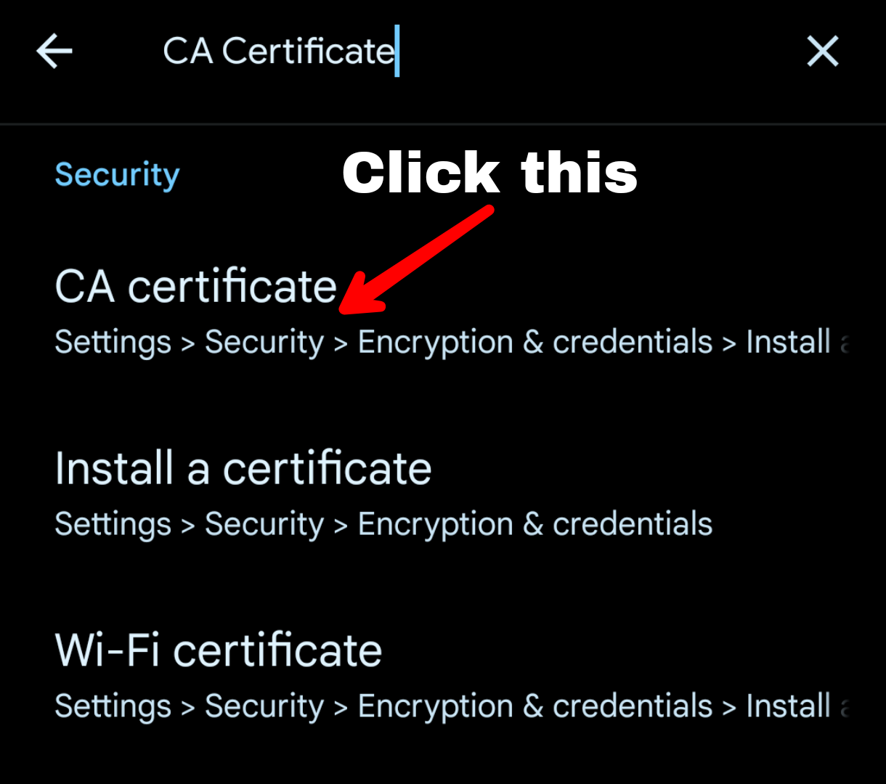<br />

**Step 2**<br />
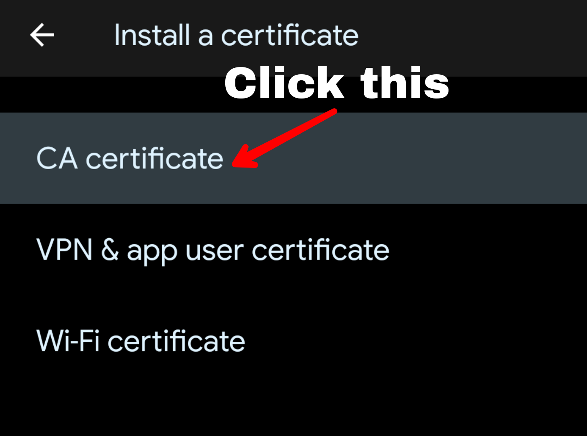<br />
**Step 3**<br />
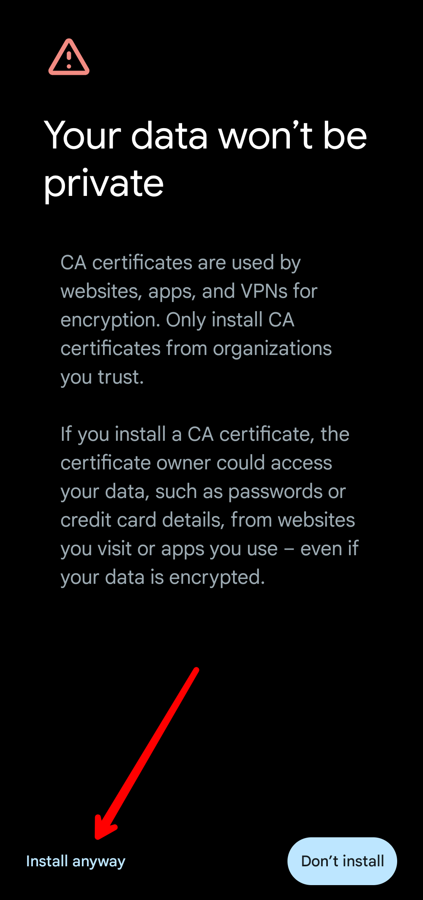<br />
**Step 4**<br />
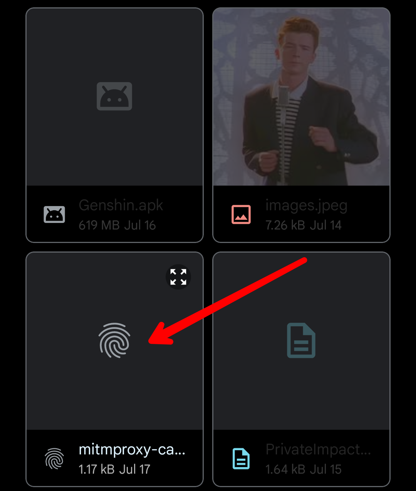<br />
**Step 5**(Done install certificate)<br />
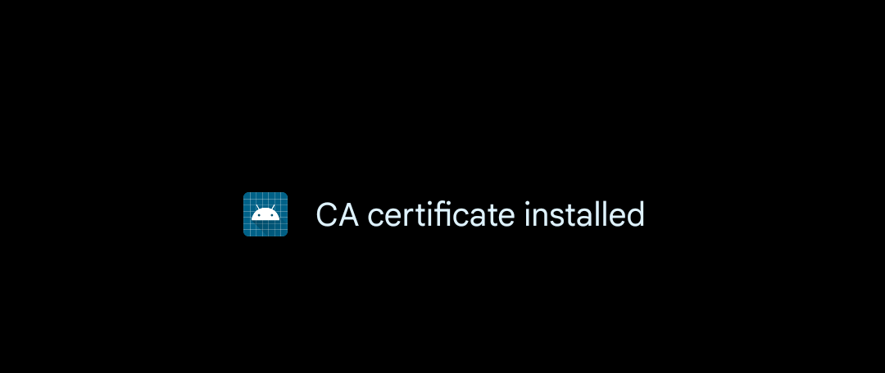

</details>

# FAQ
<details markdown='1'><summary>Faq List</summary>

#### How to play again? Does i need to follow [this](https://github.com/ElaXan/AnimeGamePatch/edit/main/README.md#termux) step again?
No. just enter command ```zex run``` then play Anime Game

#### I want to play other server. How to change server?
Using command ```zex dom``` and enter the server you want play!

#### Why it said "Password error" or trying enter username and password?
Check your Proxy settings on your phone

#### Why am I still on the original server?
Hmmm.. check your proxy on Settings. Set proxy to<br />Hostname : **127.0.0.1**<br />Port : **8080**<br />After set the Proxy go back to Termux and run command ```bash zex.sh```

#### Why i got Data Error?
Because you may the proxy not setting to<br /> Hostname : **127.0.0.1**<br />Port : **8080**<br />Try settings proxy and run ```zex run```

#### Why 0% Stuck loading?
Your data is missing, check it on settings app info, if less than 15GB (I think) you need to download again from original server

#### Why i got error when i install from [Termux](https://github.com/ElaXan/AnimeGamePatch/edit/main/README.md#termux)?
Try change your repo termux using ```termux-change-repo``` and follow [this](https://github.com/ElaXan/AnimeGamePatch#termux) step again<br />


</details>
